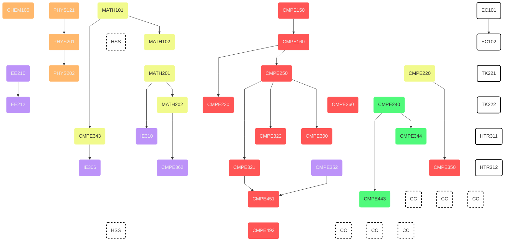

```mermaid
%%{ init: { 'flowchart': { 'curve': 'linear' } } }%%
flowchart TD

classDef cmpebox fill:#ff5555,stroke:none,stroke-width:2px,color:#eee
classDef math fill:#f1fa8c,stroke:none,stroke-width:2px, color:#333
classDef science fill:#ffb86c,stroke:none,stroke-width:2px, color:#eee
classDef general fill:none,stroke:#000,stroke-width:2px
classDef elective fill:none,stroke:#000,stroke-width:2px,stroke-dasharray: 5 5
classDef hardware fill:#50fa7b,stroke:none,stroke-width:2px, color:#333
classDef engineering fill:#bd93f9,stroke:none,stroke-width:2px, color:#eee
classDef external fill:none,stroke:#000,stroke-width:2px,stroke-dasharray: 5 5

CHEM105 ~~~~ EE210 --> EE212 
PHYS121 --> PHYS201 --> PHYS202
MATH101 --> MATH102 ~~~ MATH201 --> MATH202
CMPE343 --> IE306 
MATH201 ---> IE310
CMPE250 ~~~ CMPE260
MATH101 ~~~ HSS1 ~~~~~~~~ HSS2
 
MATH101 -----> CMPE343
MATH202 ---> CMPE362
CMPE160 ~~~ CMPE220 ----> CMPE350
CMPE250 ---> CMPE300 & CMPE322
CMPE250 ----> CMPE321
CMPE240 --> CMPE344 
CMPE220 ~~~ CMPE240 ----> CMPE443
CMPE150 --> CMPE160 --> CMPE250 
CMPE160 ---> CMPE230
CMPE352 & CMPE321 --> CMPE451 
CMPE451 ~~~ CMPE492
CMPE350 ~~~ CC1 & CC2 & CC3
CMPE443 ~~~ CC4 & CC5 & CC6

EC101 --> EC102 ~~~ TK221 ~~~ TK222 ~~~ HTR311 ~~~ HTR312

MATH101("MATH101"):::math
MATH102("MATH102"):::math
MATH201("MATH201"):::math
MATH202("MATH202"):::math

CHEM105("CHEM105"):::science
PHYS121("PHYS121"):::science
PHYS201("PHYS201"):::science
PHYS202("PHYS202"):::science


HSS1("HSS"):::elective
HSS2("HSS"):::elective

IE306("IE306"):::engineering
IE310("IE310"):::engineering

EE210("EE210"):::engineering
EE212("EE212"):::engineering

EC101("EC101"):::general
EC102("EC102"):::general

CMPE150("CMPE150"):::cmpebox
CMPE160("CMPE160"):::cmpebox

CMPE220("CMPE220"):::math
CMPE230("CMPE230"):::cmpebox
CMPE240("CMPE240"):::hardware
CMPE250("CMPE250"):::cmpebox
CMPE260("CMPE260"):::cmpebox

CMPE300("CMPE300"):::cmpebox
CMPE321("CMPE321"):::cmpebox
CMPE322("CMPE322"):::cmpebox
CMPE343("CMPE343"):::math
CMPE344("CMPE344"):::hardware
CMPE350("CMPE350"):::cmpebox
CMPE352("CMPE352"):::engineering
CMPE362("CMPE362"):::engineering

CMPE443("CMPE443"):::hardware
CMPE451("CMPE451"):::cmpebox
CMPE492("CMPE492"):::cmpebox

TK221("TK221"):::general
TK222("TK222"):::general

HTR311("HTR311"):::general
HTR312("HTR312"):::general

CC1("CC"):::elective
CC2("CC"):::elective
CC3("CC"):::elective
CC4("CC"):::elective
CC5("CC"):::elective
CC6("CC"):::elective

```
